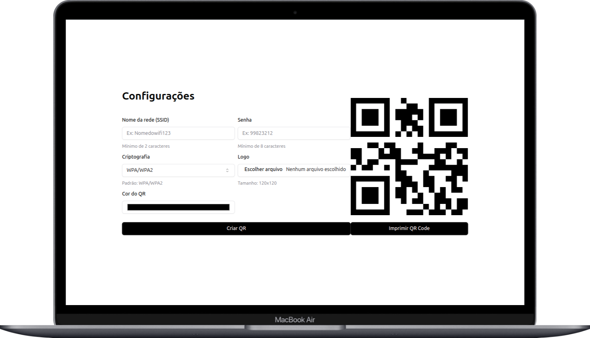

<h1 align="center">
  QR code Generator
</h1>

## 🎨 Layout

Aqui você pode conferir o layout.  

[👉 Link para visualizar a ferramenta completa.](https://qrcodegigaweb.vercel.app/)

 
   

---

## 📝 Licença

Esse projeto está sob a licença MIT. Veja o arquivo [LICENSE](LICENSE) para mais detalhes.

## 🌐 Contato

---

Made with ♥ by Gabriel Gonçalves 🖖 